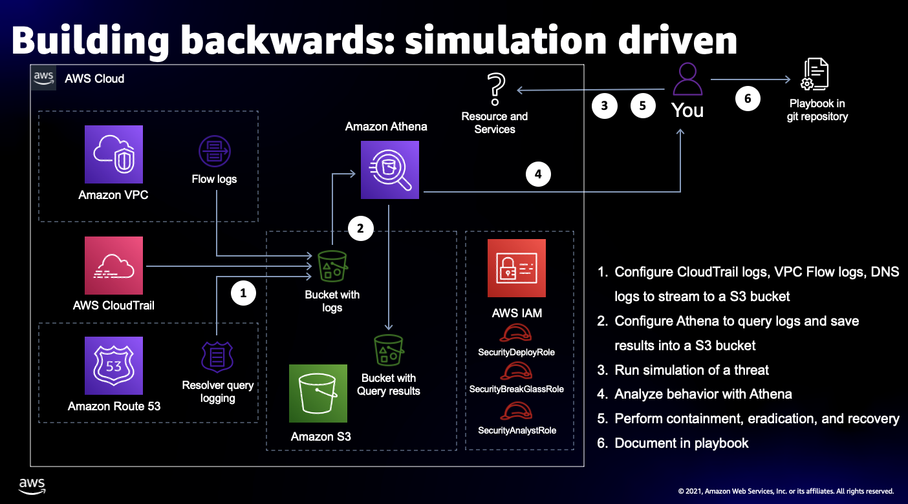

# Building Incident Response Playbooks for AWS

This project is part of the workshop [Building Incident Response Playbooks for AWS](https://aws-incident-response-playbooks.workshop.aws). Follow the workshop directions for optimal use of this repository contents.

## DO NOT DEPLOY THE CODE FROM THIS REPOSITORY IN AN EXISTING AWS ACCOUNT YOU CURRENTLY USE. CREATE A NEW SANDBOX ACCOUNT FOR THE PURPOSE OF THIS WORKSHOP.

## Sandbox environment
* This is a sandbox environment for learning purposes only. You will take the learnings from building a playbook in this controlled environment and adapt to your own environment.
* GuardDuty, CloudTrail, VPC Flow, and DNS logs are the fundamental pillars for threat detection and incident response in AWS. Focus on learning how to interpret them based on the activity generated.

## Solving customer challenges around incident response in AWS
* This project builds an environment in an AWS Account facilitating the development of playbooks enhancing customer's capability to respond to security events.
* [Amazon Athena](https://aws.amazon.com/athena/) provides analytical capabilities with pre-configured tables for querying [AWS CloudTrail](https://aws.amazon.com/cloudtrail/) logs, [Amazon VPC Flow logs](https://docs.aws.amazon.com/vpc/latest/userguide/flow-logs.html), and [Amazon Route53 VPC DNS logs](https://docs.aws.amazon.com/Route53/latest/DeveloperGuide/resolver-query-logs.html) centralized in An Amazon S3 Bucket.
* Includes two (2) sample playbook addressing the `IAM credential exposure`, and `EC2 crypto mining` threats, plus a `template` for you to develop additional scenarios.
* Includes Linux bash scripts to simulate the threats and practice the response laid out by the sample playbooks. Create your own scripts in Linux bash or other languages to support the development and testing of your own security event scenarios.

* * *

## Architecture Overview

An AWS CDK application creates one stack named `WorkshopStack` containing the minimum environment required to support the development of Incident Response Playbooks. The components are listed in the next section.

### WorkshopStack components:
* Amazon S3 Bucket centralizing all required log sources
* Amazon S3 Bucket for Athena queries results
* A VPC with public and private subnets, internet gateway, NAT gateway, and one EC2 instance  
* CloudTrail trail logging management and data events streaming to S3 bucket
* VPC DNS logs enabled for VPC streaming to S3 bucket
* VPC Flow logs enabled for VPC streaming to S3 bucket
* Athena Workgroup
* Glue database and tables
* Security analyst IAM Role to run Athena queries
* Athena administrator IAM Role to configure Athena and Glue
* Security break glass IAM Role for containment, eradication, and recovery
* Security deploy IAM Role for CloudFormation deployment of SimulationStack
* IAM User Access Key for EC2 crypto mining simulation
* IAM User Access Key for IAM credential exposure simulation
* AWS GuardDuty for alerting (enabled manually)

* * *

## Deployment
* Clone this repository and choose between [AWS CDK](https://docs.aws.amazon.com/cdk/latest/guide/home.html) or [AWS CloudFormation](https://aws.amazon.com/cloudformation/) for deployment of stacks.

### CloudFormation
Preferred deployment method for those with little coding and AWS experience.
* Login to your AWS Account
* Go to the [AWS CloudFormation console](https://console.aws.amazon.com/cloudformation)
* Create stack using cdk/cdk.out/WorkshopStack.yaml from the cloned repository

Refer to this page for getting started with [AWS CloudFormation](https://aws.amazon.com/cloudformation/getting-started/).

### AWS CDK
We recommend this method for those with excellent coding and AWS experience.  
* Install `node v18`
  * check version running `node --version`
* Install `Python 3.10`
  * check version running `python --version`
* Configure a python virtual environment
   * change directory to the root of the cloned repository
   * run `python3 -m venv .venv`
   * run `source .venv/bin/activate`
   * run `python -m pip install -r stacks/requirements.txt` 
* Install node modules
  * run `npm i`
* Install [AWS CLI v2](https://docs.aws.amazon.com/cli/latest/userguide/install-cliv2.html)
* Create IAM credentials with permission to deploy AWS resources using CloudFormation
* Configure `AWS CLI` with IAM credentials
   * run `aws configure`
   * verify by running `aws sts get-caller-identity`
* Deploy the AWS CDK app
   * run `cdk bootstrap` 
   * run `cdk synth`
   * run `cdk deploy` 

Refer to this page for getting started with [AWS CDK](https://docs.aws.amazon.com/cdk/latest/guide/getting_started.html)

* * *

## Cost

Consider the costs involved in deploying this solution beyond what is included with [AWS Free Tier](https://aws.amazon.com/free/), if applicable:

* Amazon Athena: https://aws.amazon.com/athena/pricing/
* Amazon S3: https://aws.amazon.com/s3/pricing/
* Amazon EC2: https://aws.amazon.com/ec2/pricing
* AWS CloudTrail: https://aws.amazon.com/cloudtrail/pricing/
* AWS Glue: https://aws.amazon.com/glue/pricing/
* AWS GuardDuty (manual install): https://docs.aws.amazon.com/guardduty/latest/ug/monitoring_costs.html
* * *

## Related Resources

### AWS resources
* [AWS Customer Playbook Framework](https://github.com/aws-samples/aws-customer-playbook-framework)
* [AWS re:invent 2020: Building your cloud incident response program](https://www.youtube.com/watch?v=MW7kcXL6OVo)
* [AWS Incident Response Playbook Samples (process only)](https://github.com/aws-samples/aws-incident-response-playbooks)
* [AWS Cloud Adoption Framework Security Perspective](https://d0.awsstatic.com/whitepapers/AWS_CAF_Security_Perspective.pdf)
* [AWS Well-Architected labs - Security](https://wellarchitectedlabs.com/security/)
* [AWS Security Analytics Bootstrap](https://github.com/awslabs/aws-security-analytics-bootstrap)
* [AWS API Guides and Documentation](https://docs.aws.amazon.com/index.html)
* [CloudTrail User Guide](https://docs.aws.amazon.com/awscloudtrail/latest/userguide/cloudtrail-user-guide.html)
* [Amazon VPC Flow Logs](https://docs.aws.amazon.com/vpc/latest/userguide/flow-logs.html)
* [Amazon Route53 VPC DNS resolver logs](https://docs.aws.amazon.com/Route53/latest/DeveloperGuide/resolver.html)

### Third-party resources
* [NIST Computer Security Incident Handling Guide (Special Publication 800-61 Revision 2)](https://nvlpubs.nist.gov/nistpubs/SpecialPublications/NIST.SP.800-61r2.pdf)

* * *